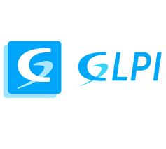
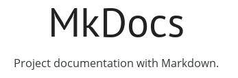

# Implementação do GLPI e Uso do MkDocs

## Implementação do GLPI

A implementação do GLPI (Gestionnaire Libre de Parc Informatique) é essencial para a gestão eficiente dos recursos de TI. O GLPI é uma ferramenta de código aberto que ajuda na administração de inventário de hardware e software, além de facilitar a gestão de tickets de suporte.

### Vantagens do GLPI:

1. **Gestão Centralizada:** Permite gerenciar todo o inventário de TI, incluindo hardware, software, e dispositivos de rede, em um único sistema.
2. **Abertura de Tickets:** Facilita o registro e acompanhamento de solicitações de suporte, melhorando o atendimento aos usuários.
3. **Relatórios Detalhados:** Gera relatórios detalhados que ajudam na tomada de decisões e na análise de desempenho da equipe de TI.
4. **Personalização:** Altamente personalizável, permitindo a adaptação às necessidades específicas da organização.
5. **Comunidade Ativa:** Suporte de uma comunidade ativa que contribui com plugins e melhorias contínuas.

## Uso do MkDocs

O MkDocs é uma ferramenta de geração de sites estáticos voltada para a criação de documentação. Ele utiliza arquivos Markdown para transformar conteúdo em sites bonitos e navegáveis.

### Vantagens do MkDocs:

1. **Facilidade de Uso:** Simples de instalar e configurar, permitindo que qualquer pessoa crie documentação rapidamente.
2. **Formato Markdown:** Utiliza Markdown, uma linguagem de marcação fácil de aprender e usar, para criar documentos.
3. **Design Atraente:** Gera sites com um design moderno e responsivo, facilitando a leitura em qualquer dispositivo.
4. **Visualização em Tempo Real:** Possibilita visualizar as mudanças em tempo real durante a edição.
5. **Integração com GitHub Pages:** Facilita a publicação da documentação na web através do GitHub Pages, sem custo adicional.

Ambas as ferramentas, GLPI e MkDocs, são poderosas e gratuitas, oferecendo soluções robustas para gestão de TI e documentação, respectivamente. A implementação e uso adequado dessas ferramentas podem melhorar significativamente a eficiência e organização de uma equipe de TI.

