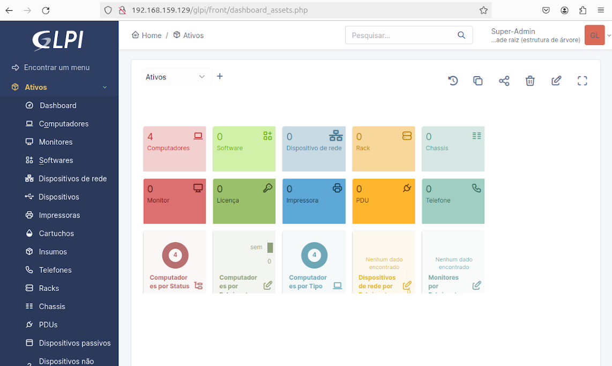
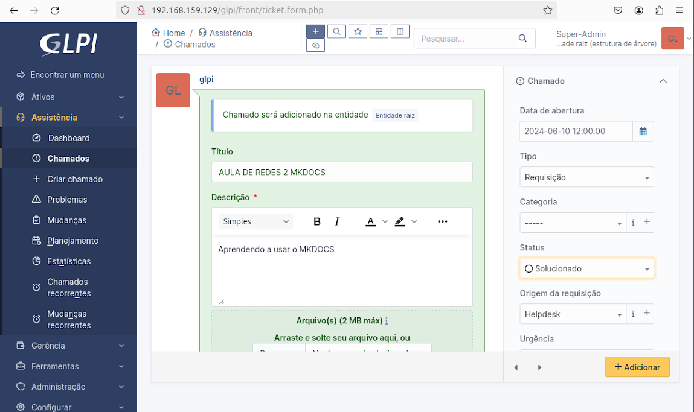
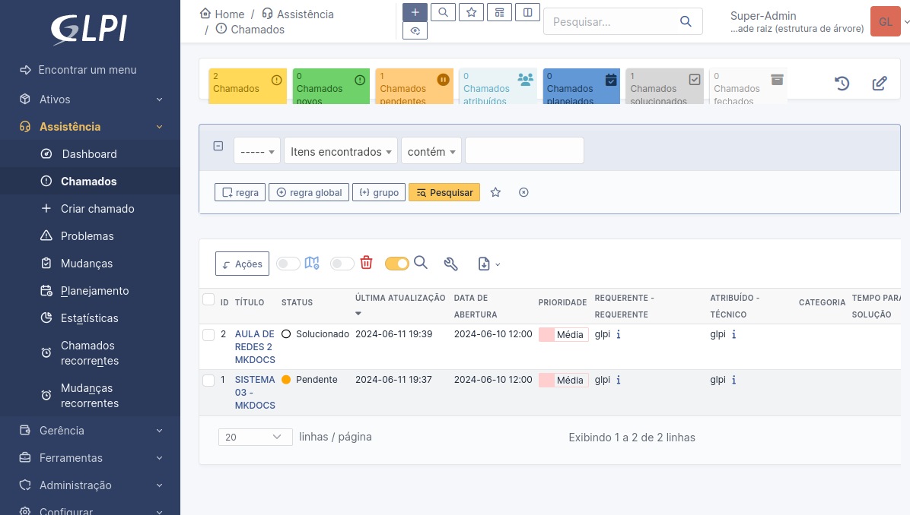
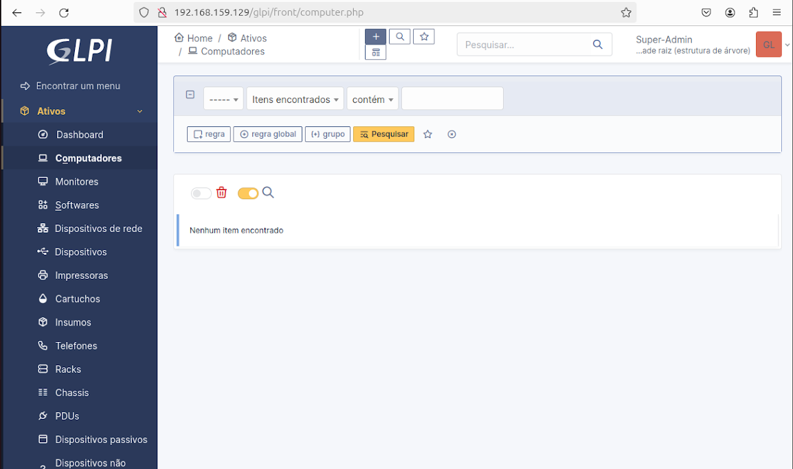
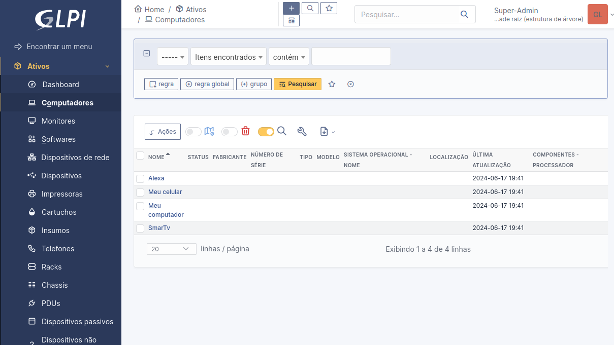

## GLPI 

O dashboard do GLPI é uma ferramenta essencial para monitorar e gerenciar as operações diárias, seja em ambientes escolares ou no ambiente corporativo. Ele oferece uma visão abrangente dos recursos de TI, permitindo um acompanhamento eficiente das atividades e uma gestão proativa de problemas.

Abaixo, está a imagem do meu dashboard em uso. 

Criar chamados no GLPI oferece organização e rastreamento eficientes para resolver problemas de TI de maneira rápida e precisa.

Adicionar ativos no GLPI permite um controle detalhado e centralizado dos recursos de TI, facilitando a gestão e a manutenção. Isso melhora a visibilidade e a eficiência na administração do inventário de hardware e software.

Abaixo, está a imagem dos meus ativos.

