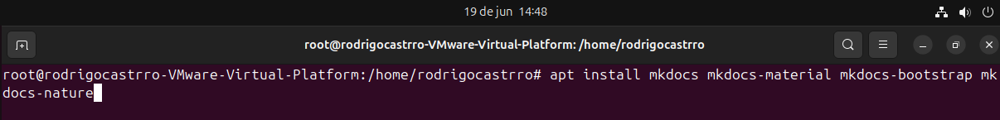

## Mkdocs 
Nesse tópico faremos um mini tutorial de como configurar e criar e documentar usando MkDocs

Primeiro comando: Este comando instala o MkDocs e vários temas adicionais para a criação de documentação

O comando a seguir cria um novo projeto de documentação com MkDocs

O comando a seguir abre o arquivo de configuração do MkDocs no editor de texto Nano.
MkDocs.yml: Arquivo de configuração do MkDocs onde você pode definir a estrutura do site, temas, e outras configurações.

O comando a seguir inicia um servidor local do MkDocs, disponibilizando a documentação em um endereço IP específico e uma porta definida:

O comando a seguir gera a versão estática da documentação do projeto MkDocs e constrói a documentação em arquivos HTML estáticos, armazenando-os na pasta site do projeto.

Pronto, agora basta você copiar para o seu servidor Apache com o comando cp -R site /var/www/html/ que você terá uma página HTML estática criada pelo MkDocs. 
